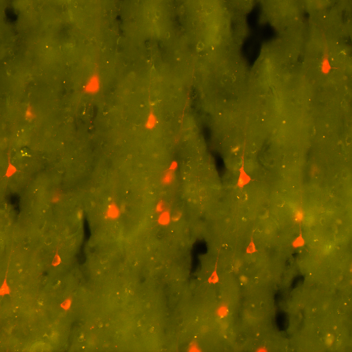
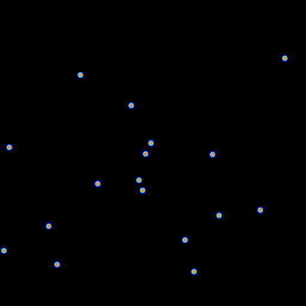

# Deep Learning-Based Neuron Counting for Mesoscopic Brain Connectivity Study in Macaques

Accurate enumeration and localization of macaque neurons labeled by neuronal tracers are crucial for quantitatively assessing brain connectivity patterns and constructing a mesoscopic brain connectome atlas. However, methodological challenges and limitations in dataset construction impede this scientific progress. In this project, we constructed a dataset of Macaque Fluorescently Labeled Neurons (MFN) obtained through retrograde neuronal tracing experiments on three rhesus macaque brains. This dataset, comprised of 1600 images and collaboratively annotated by six experts, generated 33,411 neuron annotations. Leveraging this dataset, we developed a cell counting model, Dense Convolutional Attention U-Net (DAUNet).

*MFN dataset*: 

In this project, we have uploaded 50 original-resolution images and their corresponding annotations with consistent labeling. To save storage space, we also provide all images and annotations from the full dataset (1,600 samples) in a resized resolution of 256×256.

If you require access to the full dataset in original resolution, please contact us via email: [dongzhenwei2019@ia.ac.cn]().

