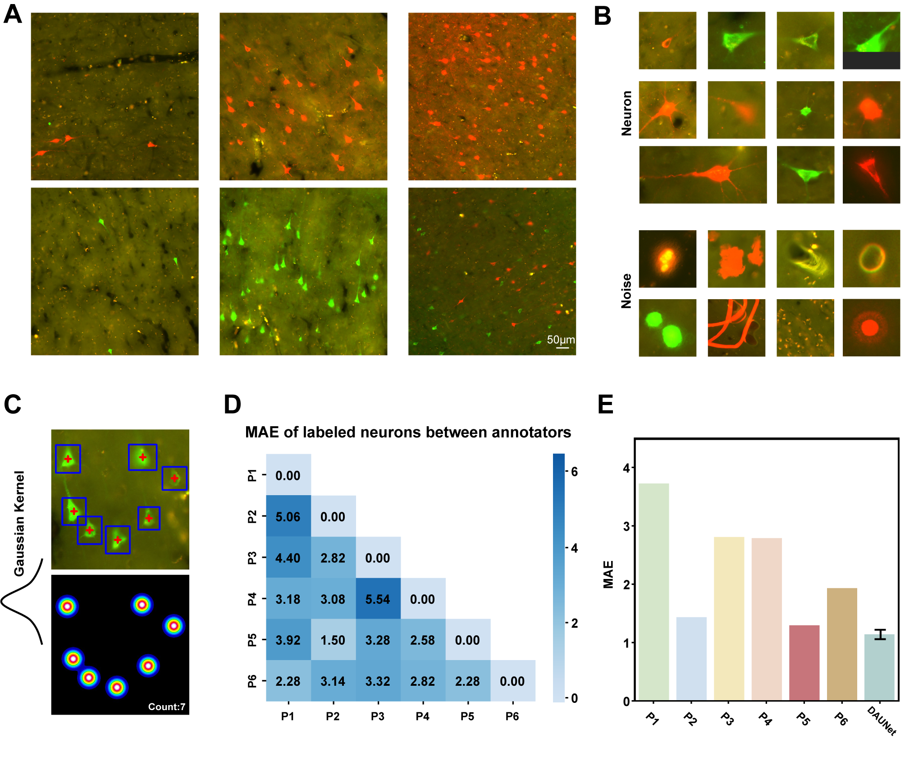

# DAUNet （IEEE TMI 2025）
### [**Paper**](https://ieeexplore.ieee.org/document/11225902)
Deep Learning-Based Neuron Counting for Mesoscopic Brain Connectivity Study in Macaques 


##  Abstract
Precise quantification and localization of tracer-labeled neurons are essential for unraveling brain connectivity patterns and constructing a mesoscopic brain connectome atlas in macaques. However, methodological challenges and limitations in dataset development have impeded this scientific progress. This work introduced the Macaque Fluorescently Labeled Neurons (MFN) dataset, derived from retrograde tracing on three rhesus macaques. The dataset, meticulously annotated by six specialists, includes 1,600 images and 33,411 high-quality neuron annotations. Leveraging this dataset, we developed a Dense Convolutional Attention U-Net (DAUNet) cell counting model. By integrating Dense Convolutional blocks and a multi-scale attention module, the model exhibits robust feature extraction and representation capabilities while maintaining low complexity. On the MFN dataset, DAUNet achieved a Mean Absolute Error of 0.97 for cell counting and an F1-score of 96.29% for cell localization, outperforming several benchmark models..

## *MFN dataset*: 
The MFN dataset addresses the current scarcity of publicly available datasets for fluorescently labeled neurons in macaques. It captures a wide range of structural and distribution patterns of tracer-labeled neurons, supporting research on mesoscopic brain connectivity in macaques.



Fig. The proposed macaque fluorescently labeled neuron (MFN) dataset. A: Example images from the MFN dataset. The neurons exhibit variations in distribution patterns. B: Distinction between target neurons and noise. C: Annotation for target neurons. D: Annotation differences among annotators. E: Neuron counting errors among annotators and the DAUNet on the co-annotated image set (n = 50 samples).

In this project, we have uploaded 50 original-resolution images and their corresponding annotations with consistent labeling. To save storage space, we also provide all images and annotations from the full dataset (1,600 samples) in a resized resolution of 256×256.

If you require access to the full dataset in original resolution, please contact us via email: dongzhenwei2019@ia.ac.cn.


#
If you find this work useful, please consider citing our early access paper:
```bibtex
@ARTICLE{11225902,
  author={Dong, Zhenwei and Liu, Xinyi and Shi, Weiyang and Lu, Yuheng and Liu, Yanyan and Hou, Xiaoxiao and Sun, Hongji and Song, Ming and Yang, Zhengyi and Jiang, Tianzi},
  journal={IEEE Transactions on Medical Imaging}, 
  title={Neuron Counting for Macaque Mesoscopic Brain Connectivity Research}, 
  year={2025},
  volume={},
  number={},
  pages={1-1},
  keywords={Neurons;Fluorescence;Computer architecture;Brain modeling;Microprocessors;Microscopy;Annotations;Imaging;Brain;Surgery;Cell Counting;Cell Localization;Fluorescence Microscopy Image;Macaque Neuron;Neuronal Tracing},
  doi={10.1109/TMI.2025.3628678}}
```

---